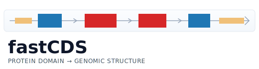
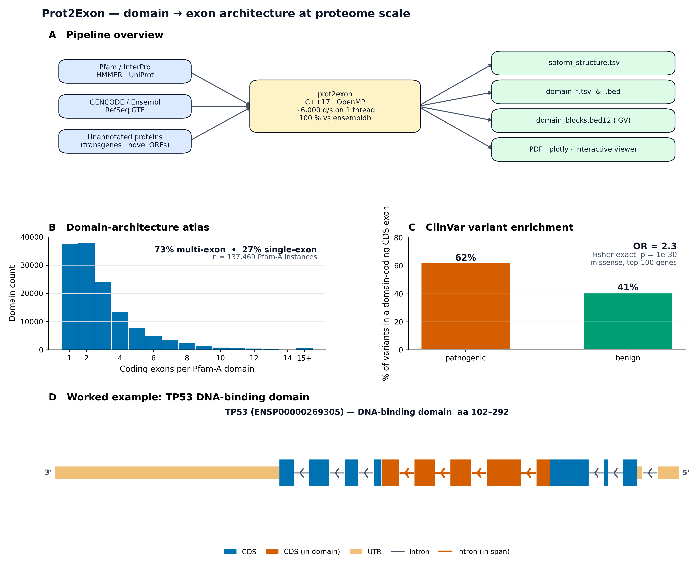

<p align="center">
  
</p>

<h1 align="center">Prot2Exon</h1>

<p align="center">
  <a href="https://pypi.org/project/prot2exon/"></a>
  <a href="https://bioconda.github.io/recipes/prot2exon/README.html"></a>
  <a href="https://pixi.sh/"></a>
  <a href="https://pypi.org/project/prot2exon/"></a>
  <br>
  <a href="https://github.com/SotoLF/Prot2Exon/actions"></a>
  <a href="https://github.com/SotoLF/Prot2Exon/wiki"></a>
  <a href="LICENSE"></a>
  <a href="https://github.com/SotoLF/Prot2Exon/stargazers"></a>
</p>

Map protein-domain amino-acid coordinates to their underlying genomic CDS / UTR / intron structure, using any Ensembl, GENCODE, or NCBI RefSeq GTF.

For each input query (a `protein_id` **or** a `transcript_id`, optionally with an aa range), Prot2Exon answers two related but distinct questions:

1. **Mapping** — *which exact genomic bases code this domain?*
2. **Structure / visualization** — *how is the whole transcript organised in 5′UTR / CDS / 3′UTR / intron, and where does the domain fall on it?*

A C++17 binary does the heavy lifting (~1 µs per query on a warm index, ~2,800 queries/s in `--output all`). A Python wrapper gives you pandas DataFrames and three plot styles (matplotlib, plotly, and a vanilla-JS standalone HTML viewer).

📖 **[Full documentation lives in the wiki →](https://github.com/SotoLF/Prot2Exon/wiki)**

## Install

### pip

```bash
pip install prot2exon                # CLI + Python wrapper
pip install "prot2exon[html]"        # also pulls plotly for interactive HTML
```

### bioconda

```bash
mamba install -c bioconda prot2exon
```

### pixi

```bash
pixi add prot2exon
```

### From source

```bash
git clone https://github.com/SotoLF/Prot2Exon.git
cd Prot2Exon
mkdir build && cd build
cmake -DCMAKE_BUILD_TYPE=Release ..
make -j$(nproc)
```

See [Installation](https://github.com/SotoLF/Prot2Exon/wiki/Installation) for Docker, CI, and the binary-discovery logic the Python wrapper uses.

## Quickstart

```bash
# 1. Get an index (one-time per annotation)
python3 -m prot2exon.fetch human --release 49

# 2. Map a BED of domain queries
prot2exon \
    --index ~/.cache/prot2exon/gencode_human_v49.idx \
    --bed queries.bed --out-dir results --output all --threads 8

# 3. Plot a single domain
prot2exon plot \
    --isoform results/isoform_structure.tsv \
    --input-id TP53_DBD \
    --html-interactive tp53_dbd.html
```

`queries.bed` is whitespace-separated; see [Input format](https://github.com/SotoLF/Prot2Exon/wiki/Input-format) for the spec.

Python API:

```python
import prot2exon as p2e

mapper = p2e.Mapper(index="human.idx")
result = mapper.map_batch([
    {"protein_id": "ENSP00000269305", "aa_start": 102, "aa_end": 292, "domain_id": "TP53_DBD"},
])
result.summary       # one-row DataFrame
result.isoform       # plot-ready DataFrame

# Three rendering paths, same data
p2e.plot(result, input_id="TP53_DBD", out="tp53_dbd.pdf")            # matplotlib
p2e.plot(result, input_id="TP53_DBD", html="tp53_dbd.html")          # plotly
p2e.plot(result, input_id="TP53_DBD", html_interactive="tp53_dbd.html")  # vanilla JS
p2e.render_interactive_jupyter(segs, plot_height=160)                   # inline in a notebook
```

Full API: [Python API wiki page](https://github.com/SotoLF/Prot2Exon/wiki/Python-API).

## Topics in the wiki

| Page | What's on it |
|---|---|
| [Quickstart](https://github.com/SotoLF/Prot2Exon/wiki/Quickstart) | End-to-end in five commands. |
| [Input format](https://github.com/SotoLF/Prot2Exon/wiki/Input-format) | BED columns, ENSP vs ENST, no-domain mode, prep scripts. |
| [Output modes](https://github.com/SotoLF/Prot2Exon/wiki/Output-modes) | `coding` / `introns` / `span` / `isoform` / `bed12` / `all` + coordinate conventions. |
| [Plotting and viewers](https://github.com/SotoLF/Prot2Exon/wiki/Plotting-and-viewers) | matplotlib, plotly, the interactive HTML viewer, Jupyter embed. |
| [Python API](https://github.com/SotoLF/Prot2Exon/wiki/Python-API) | `Mapper`, `MappingResult`, `plot`, viewer helpers. |
| [Genome onboarding](https://github.com/SotoLF/Prot2Exon/wiki/Genome-onboarding) | `prot2exon fetch`, manual recipes, GTF compatibility. |
| [Custom proteins](https://github.com/SotoLF/Prot2Exon/wiki/Custom-proteins) | Append unannotated proteins (transgenes, non-reference ORFs, …) to an existing GTF. |
| [Performance and RAM](https://github.com/SotoLF/Prot2Exon/wiki/Performance-and-RAM) | `--threads`, `--batch-size`, 1 M-query benchmark. |
| [Architecture](https://github.com/SotoLF/Prot2Exon/wiki/Architecture) | What lives where: parser, mapper, writer, index format. |
| [FAQ](https://github.com/SotoLF/Prot2Exon/wiki/FAQ) | Common gotchas: CDS-length mismatch, MANE Select, "index already exists", … |

<p align="center">
  
</p>

> **Figure 1 of the paper.** Pipeline overview · Pfam-A proteome atlas (137,469 domains; 73 % multi-exon) · ClinVar pathogenic vs benign variant enrichment in domain-coding exons (OR = 2.3, p = 1e-30) · TP53 DNA-binding domain worked example. Generate with `python benchmarks/make_figure_1.py --pfam-atlas-tsv <path> --tp53-isoforms examples/tp53_isoforms.tsv --out-dir figures/`.

## Validation + benchmarks

- **100.00 % exact match vs ensembldb** on 5,000 stratified queries (9 strata covering single/multi-exon, both strands, codon-split, selenoproteins, incomplete CDS) — zero off-by-ones, zero structural mismatches. Full design + numbers on the [Validation wiki page](https://github.com/SotoLF/Prot2Exon/wiki/Validation).
- **~900× faster than ensembldb, ~4.4× TransVar, ~5,400× Ensembl REST** at N = 10,000 single-threaded; reaches 5,847 queries/s. Same correctness, smaller index. Full 4-tool Table 1 on the [Benchmarks wiki page](https://github.com/SotoLF/Prot2Exon/wiki/Benchmarks).
- Reproduce both: see [`benchmarks/README.md`](benchmarks/README.md).

## Notebooks

Worked examples live under [`notebooks/`](notebooks/):

| Notebook | What it covers |
|---|---|
Each row has one-click launchers via Colab (interactive) and nbviewer (read-only preview).

| Notebook | What it covers | Launch |
|---|---|---|
| [`walkthrough_end_to_end.ipynb`](notebooks/walkthrough_end_to_end.ipynb) | Five-step tour: `fetch_index` → BED prep → `Mapper.map_batch` → matplotlib / compact-genomic / interactive HTML / inline Jupyter / plotly. Uses yeast for the live mapping demo and the bundled TP53 fixture for the plot showcases. | [](https://colab.research.google.com/github/SotoLF/Prot2Exon/blob/main/notebooks/walkthrough_end_to_end.ipynb) · [nbviewer](https://nbviewer.org/github/SotoLF/Prot2Exon/blob/main/notebooks/walkthrough_end_to_end.ipynb) |
| [`validation.ipynb`](notebooks/validation.ipynb) | Loads `validate_vs_ensembldb.py`'s `table1.tsv` and renders the per-stratum agreement plot — the numbers behind the [Validation wiki page](https://github.com/SotoLF/Prot2Exon/wiki/Validation). | [](https://colab.research.google.com/github/SotoLF/Prot2Exon/blob/main/notebooks/validation.ipynb) · [nbviewer](https://nbviewer.org/github/SotoLF/Prot2Exon/blob/main/notebooks/validation.ipynb) |
| [`software_comparison.ipynb`](notebooks/software_comparison.ipynb) | 4-tool head-to-head — prot2exon vs ensembldb vs TransVar vs Ensembl REST. Throughput + memory + agreement bars. | [](https://colab.research.google.com/github/SotoLF/Prot2Exon/blob/main/notebooks/software_comparison.ipynb) · [nbviewer](https://nbviewer.org/github/SotoLF/Prot2Exon/blob/main/notebooks/software_comparison.ipynb) |
| [`benchmarking.ipynb`](notebooks/benchmarking.ipynb) | Wall-clock and peak-RSS scaling curves, parallel speedup, the `--batch-size` RAM cap at N = 1 M. | [](https://colab.research.google.com/github/SotoLF/Prot2Exon/blob/main/notebooks/benchmarking.ipynb) · [nbviewer](https://nbviewer.org/github/SotoLF/Prot2Exon/blob/main/notebooks/benchmarking.ipynb) |
| [`pfam_proteome_atlas.ipynb`](notebooks/pfam_proteome_atlas.ipynb) | Map every Pfam-A domain on the human proteome and compute architecture statistics (single- vs multi-exon, fraction in largest exon, intron burden). Panel B of the paper figure. | [](https://colab.research.google.com/github/SotoLF/Prot2Exon/blob/main/notebooks/pfam_proteome_atlas.ipynb) · [nbviewer](https://nbviewer.org/github/SotoLF/Prot2Exon/blob/main/notebooks/pfam_proteome_atlas.ipynb) |
| [`clinvar_pathogenic.ipynb`](notebooks/clinvar_pathogenic.ipynb) | Test the "pathogenic variants concentrate in domain-coding exons" hypothesis on ClinVar missense calls. Panel C of the paper figure. | [](https://colab.research.google.com/github/SotoLF/Prot2Exon/blob/main/notebooks/clinvar_pathogenic.ipynb) · [nbviewer](https://nbviewer.org/github/SotoLF/Prot2Exon/blob/main/notebooks/clinvar_pathogenic.ipynb) |

## Status

Active development. The C++ core and Python wrapper are stable; the wiki is the canonical user-facing reference.

- **109 / 2** in the end-to-end test suite (`python3 tests/run_tests.py`).
- 100 % agreement against ensembldb / Ensembl REST on overlapping calls.

## Citation

A formal citation will land when the accompanying manuscript is posted. Until then, please cite the repository URL: <https://github.com/SotoLF/Prot2Exon>.

## License

MIT — see [LICENSE](LICENSE).

## Maintainers

- **Owner**: Luis F. Soto Ugaldi ([@SotoLF](https://github.com/SotoLF))
- **Collaborator**: George D. Muñoz Esquivel ([@george123ya](https://github.com/george123ya))

Issues and pull requests welcome.
