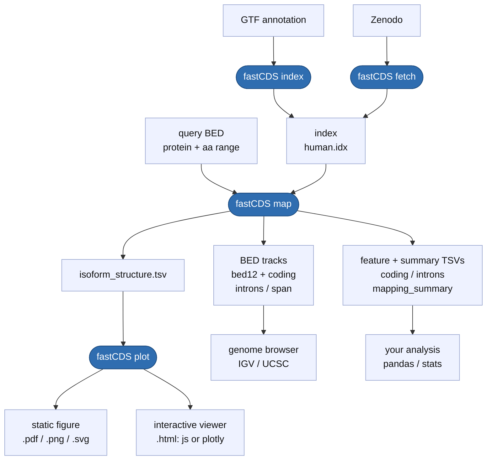

<p align="center">
  
</p>

<h3 align="center">Fast, exact protein-to-genome coordinate mapping</h3>
<p align="center"><em>map a protein feature's amino-acid range onto its genomic exon and CDS structure</em></p>

<p align="center">
  <a href="https://pypi.org/project/fastCDS/"></a>
  <a href="https://bioconda.github.io/recipes/fastCDS/README.html"></a>
  <a href="https://pixi.sh/"></a>
  <a href="https://github.com/SotoLF/fastCDS/wiki"></a>
  <a href="LICENSE"></a>
</p>

<p align="center">
  
  <br>
  <em>The TP53 DNA-binding domain mapped across four isoforms on a shared genomic axis (self-contained interactive viewer).</em>
</p>

Map protein-domain amino-acid coordinates to their underlying genomic CDS / UTR / intron structure, using any Ensembl, GENCODE, or NCBI RefSeq GTF.

For each input query (a `protein_id` **or** a `transcript_id`, optionally with an aa range), fastCDS answers two related but distinct questions:

1. **Mapping** - *which exact genomic bases code this domain?*
2. **Structure** - *how is the whole transcript organised in 5'UTR / CDS / 3'UTR / intron, and where does the domain fall on it?*

A C++17 binary does the heavy lifting: once the index is loaded, the mapping itself is ~1 us per query, so end-to-end throughput is dominated by output formatting (~5,800 queries/s for a single-isoform TSV, ~2,800 q/s writing the full `--output all` set). fastCDS produces three kinds of output: a **BED12 track** for genome browsers, a **static figure** (matplotlib PDF/PNG/SVG), and an **interactive HTML viewer**. A Python wrapper adds pandas DataFrames; for the viewer you pick the engine (self-contained vanilla JS by default, or plotly).

📖 **[Full documentation lives in the wiki](https://github.com/SotoLF/fastCDS/wiki)**

## Install

```bash
pip install fastCDS                                 # pre-built wheel: binary + wrapper (Linux/macOS)
mamba install -c bioconda -c conda-forge fastCDS    # or via conda/mamba
pixi add -c bioconda -c conda-forge fastCDS         # or via pixi
```

The pip wheel bundles the compiled binary, so all four commands work immediately. On platforms without a wheel (e.g. Windows) pip builds from source - see [Installation](https://github.com/SotoLF/fastCDS/wiki/Installation) for the toolchain and a from-source build.

## Quickstart

The workflow is three steps - get an index (`index` from a GTF, or `fetch` a pre-built one), `map` your domain queries onto it, then `plot`:



```bash
# 1. Get an index (one-time per annotation)
fastCDS index --gtf my.gtf --out human.idx   # build from a GTF you already have
# or skip the GTF - grab a pre-built index from Zenodo:
fastCDS fetch human --out human.idx

# 2. Map a BED of domain queries
fastCDS map \
    --index human.idx \
    --bed queries.bed --out-dir results --output all --threads 8

# 3. Plot a single domain - the --out extension picks the format
fastCDS plot \
    --isoform results/isoform_structure.tsv \
    --input-id TP53_DBD \
    --out tp53_dbd.pdf              # static figure (.pdf/.png/.svg)
#   --out tp53_dbd.html            # interactive viewer (vanilla JS by default)
#   --out tp53_dbd.html --engine plotly
```

Run `fastCDS fetch list` to see every target and source.

The same workflow from Python:

```python
import fastCDS as fc

# 1. Get an index (one-time)
idx = fc.build_index("my.gtf", out="human.idx")    # build from a GTF; Path-returning
# idx = fc.fetch_index("human")                    # or grab a pre-built one from Zenodo

# 2. Map queries
mapper = fc.Mapper(index=str(idx))
result = mapper.map_batch([
    {"protein_id": "ENSP00000269305", "aa_start": 102, "aa_end": 292, "domain_id": "TP53_DBD"},
])
result.summary       # one-row DataFrame
result.isoform       # plot-ready DataFrame

# 3. Plot - the out extension picks the format; engine picks the HTML renderer
fc.plot(result, input_id="TP53_DBD", out="tp53_dbd.pdf")                    # static figure
fc.plot(result, input_id="TP53_DBD", out="tp53_dbd.html")                   # interactive (vanilla JS)
fc.plot(result, input_id="TP53_DBD", out="tp53_dbd.html", engine="plotly")  # interactive (plotly)
```

Full reference: [Building an index](https://github.com/SotoLF/fastCDS/wiki/Index), [Mapping](https://github.com/SotoLF/fastCDS/wiki/Mapping), [Plotting](https://github.com/SotoLF/fastCDS/wiki/Plotting), [Python API](https://github.com/SotoLF/fastCDS/wiki/Python-API).

## Validation + benchmarks

- **100.00 % exact match vs ensembldb** on 5,000 stratified queries (9 strata covering single/multi-exon, both strands, codon-split, selenoproteins, incomplete CDS) - zero off-by-ones, zero structural mismatches.
- **~980x faster than ensembldb** (also ~4,560x Ensembl REST) - measured *end-to-end*: total wall time from process start to all results written, including the one-time index load, over N = 10,000 queries on one thread (fastCDS 5,886 q/s vs ensembldb 6.0 q/s; REST at N = 1,000, the largest it finishes). The gap grows with N because fastCDS amortizes its ~1.5 s index load; the per-query mapping itself, once loaded, is faster still.
- Full design, numbers, and scaling curves: [Performance and benchmarking](https://github.com/SotoLF/fastCDS/wiki/Performance-and-Benchmarking). Reproduce via [`reproduce_benchmarking_figures/benchmarks/README.md`](reproduce_benchmarking_figures/benchmarks/README.md).

## Notebooks

Worked examples under [`tutorial/`](tutorial/) - each opens in [Colab](https://colab.research.google.com/github/SotoLF/fastCDS) or [nbviewer](https://nbviewer.org/github/SotoLF/fastCDS). They reproduce the manuscript's example analyses; see [`reproduce_benchmarking_figures/README.md`](reproduce_benchmarking_figures/README.md) and [`reproduce_isoform_figures/README.md`](reproduce_isoform_figures/README.md) for run order.

| Notebook | What it covers |
|---|---|
| [`walkthrough_end_to_end.ipynb`](tutorial/walkthrough_end_to_end.ipynb) ([view on nbviewer](https://nbviewer.org/github/SotoLF/fastCDS/blob/main/tutorial/walkthrough_end_to_end.ipynb)) | Zero-to-figure tour: `fetch_index` -> BED prep -> `map_batch` -> all plot styles. The interactive HTML viewers only render on **nbviewer**, not GitHub. |
| [`reproduce_isoform_figures/`](reproduce_isoform_figures/) | Projects every source-isoform Pfam domain onto a gene's alternative isoforms and scores retention (intact / skipped / trimmed) - the analysis behind **Figure 1C-F**. |
| [`software_comparison.ipynb`](reproduce_benchmarking_figures/notebooks/software_comparison.ipynb) | **Accuracy + speed**: per-category agreement vs `ensembldb` / GenomicFeatures / TransVar / Ensembl REST (Table S1), and throughput + RSS vs ensembldb / GenomicFeatures / geneplot / REST (Table S2), on the same human set. |
| [`scaling_and_ram.ipynb`](reproduce_benchmarking_figures/notebooks/scaling_and_ram.ipynb) | fastCDS measured against itself (not other tools): wall-clock + peak-RSS scaling curves, OpenMP speedup, and the `--batch-size` RAM cap at N = 1 M. |

## Citation

A formal citation will land when the accompanying manuscript is posted. Until then, please cite the repository URL: <https://github.com/SotoLF/fastCDS>. See also [`CITATION.cff`](CITATION.cff).

## License

MIT - see [LICENSE](LICENSE).

## Maintainers

- **Owner**: Luis F. Soto Ugaldi ([@SotoLF](https://github.com/SotoLF))
- **Collaborator**: George D. Muñoz Esquivel ([@george123ya](https://github.com/george123ya))

Issues and pull requests welcome.
