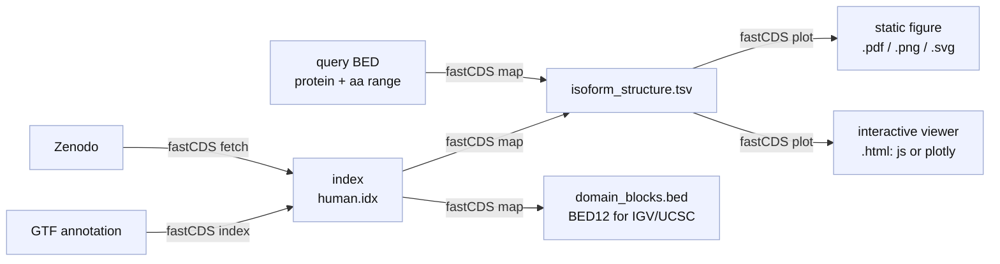

# fastCDS

Map protein-domain amino-acid coordinates to their underlying genomic CDS/UTR/intron structure, using any GENCODE, Ensembl, or NCBI RefSeq GTF.

For each input query - a `protein_id` **or** a `transcript_id`, optionally with an aa range - fastCDS answers two related questions:

1. **Mapping** - *which exact genomic bases code this domain?*
2. **Structure** - *how is the whole transcript organised into 5'UTR / CDS / 3'UTR / intron, and where does the domain fall on it?*

## The workflow

Three steps: get an index (build it from a GTF with `index`, or `fetch` a pre-built one), `map` your queries onto it, then `plot`.



The same four commands, in order:

```bash
fastCDS index gencode.v49.primary_assembly.annotation.gtf  # 1a build an index 
fastCDS fetch human --out human.idx     # 1b get a pre-built index from Zenodo
fastCDS map   --index human.idx \           # 2. map queries   -> see Mapping
                --bed queries.bed --out-dir results --output all
fastCDS plot  --isoform results/isoform_structure.tsv \   # 3. plot -> see Plotting
                --input-id TP53_DBD --out tp53.pdf
```

| Command | Does | Page |
|---|---|---|
| `index` | Build a binary index from a GTF. | [Building an index](Index) |
| `fetch` | Download a pre-built index from Zenodo. | [Building an index](Index) |
| `map`   | Map protein/domain queries to genomic structure. | [Mapping](Mapping) |
| `plot`  | Render a static (PDF/PNG) or interactive (HTML) figure. | [Plotting](Plotting) |

The same workflow from Python:

```python
import fastCDS as fc

idx = fc.fetch_index("human")
mapper = fc.Mapper(index=idx)
result = mapper.map_batch([
    {"protein_id": "ENSP00000269305", "aa_start": 102, "aa_end": 292, "domain_id": "TP53_DBD"},
])
result.summary          # DataFrame, one row per query
fc.plot(result, input_id="TP53_DBD", out="tp53.pdf")
```

New here? Start with [[Installation]], then walk the sidebar top to bottom. The [[Tutorials and Notebooks]] page has a copy-paste run from zero to a figure.
