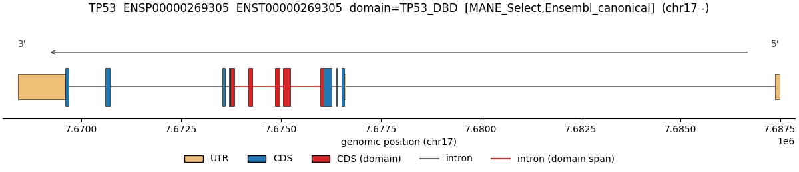
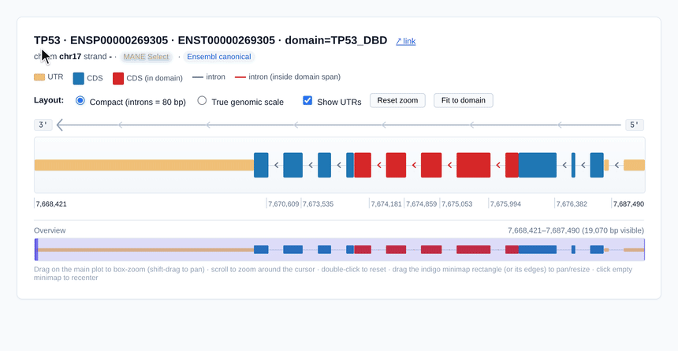
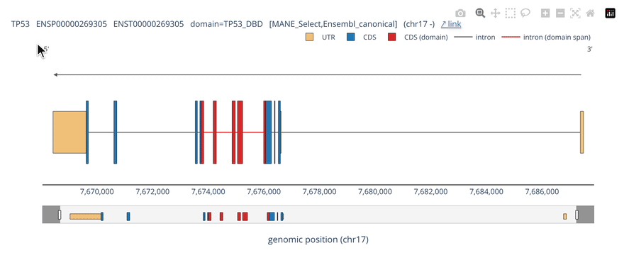
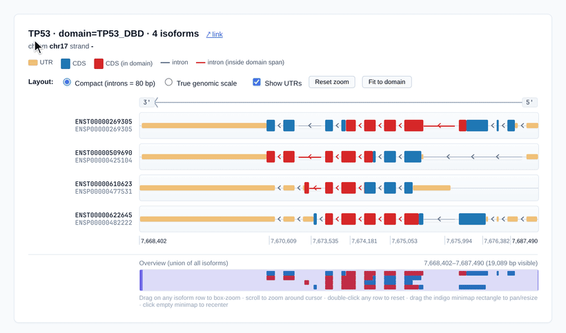

# Plotting (`fastCDS plot`)

Once you have an `isoform_structure.tsv` from [[Mapping]], `fastCDS plot` renders it as a static figure or as an interactive viewer. There is one output flag, `--out`, and its extension picks the format: `.pdf` / `.png` / `.svg` give a static matplotlib figure, and `.html` gives the interactive viewer. For `.html`, `--engine` chooses the renderer — a self-contained vanilla-JS viewer (`js`, the default, no dependencies) or `plotly`. The plotter reads the TSV directly and never re-derives coordinates from the genome, so anything you can express by editing the table is plottable.

Together with the BED12 track written by [[Mapping]], these are fastCDS's three output types: the **BED12 track** for genome browsers, the **static figure**, and the **interactive viewer** (`js` or `plotly` engine).

## At a glance

The extension of the output picks the format; there is nothing else to choose except the interactive engine.

| You want | CLI | Python |
|---|---|---|
| Static PDF (or `.png` / `.svg`) | `--out fig.pdf` | `fc.plot(result, input_id="ID", out="fig.pdf")` |
| Interactive, self-contained (default) | `--out fig.html` | `fc.plot(result, input_id="ID", out="fig.html")` |
| Interactive, plotly | `--out fig.html --engine plotly` | `fc.plot(result, input_id="ID", out="fig.html", engine="plotly")` |
| Every query at once | `--all --out figs.pdf` | `fc.plot_all(result, out="figs.pdf")` |
| Just the Figure object (no file) | — | `fig = fc.plot(result, input_id="ID")` |
| Inline in a Jupyter notebook | — | `fc.render_interactive_jupyter(segs)` |

`--all` with a `.pdf` target is one multipage PDF; with any other extension it writes one file per query (`figs.<input_id>.ext`). The CLI reads an `isoform_structure.tsv` (`--isoform FILE`); the Python `plot()` also accepts a `MappingResult` or a DataFrame directly.

## The three renderers side by side

Same isoform (TP53, DBD highlighted), rendered three ways:

| Static (matplotlib) | Interactive — vanilla JS (default) | Interactive — plotly |
|---|---|---|
|  |  |  |
| `--out fig.pdf` (or `.png`/`.svg`) | `--out fig.html` | `--out fig.html --engine plotly` |
| Publication-ready vector/raster; no interaction. | Self-contained (~40 KB), no deps, offline: box-zoom, pan, wheel-zoom, draggable minimap. | CDN-backed; hover tooltips + bottom rangeslider. |

Regenerate all three from the bundled TP53 fixture (no index or network needed) — screenshot the `.html` panels (or record a GIF) to refresh the interactive images:

```bash
python tutorial/examples/make_plot_gallery.py --out-dir plot_gallery
# -> plot_gallery/plot_matplotlib.png   (embed as-is)
#    plot_gallery/plot_js.html          (open in a browser, screenshot / record)
#    plot_gallery/plot_plotly.html      (needs: pip install "fastCDS[plotly]")
```

## Multiple isoforms on one axis

`render_interactive_html_stack` draws every isoform of a gene on a shared genomic axis, with the queried domain marked in red on each isoform that codes it:



## Static figures

### CLI

Render a single query to a vector PDF:

```bash
fastCDS plot \
    --isoform results/isoform_structure.tsv \
    --input-id TP53_DBD \
    --out tp53.pdf
```

The output format follows the file extension (`.pdf`, `.png`, or `.svg`). To render every `input_id` in the TSV at once, use `--all`; with a `.pdf` target this becomes a single multipage PDF (one query per page), while a `.png`/`.svg` target writes one file per query named `base.<input_id>.ext`:

```bash
fastCDS plot --isoform results/isoform_structure.tsv --all --out queries.pdf   # multipage PDF
fastCDS plot --isoform results/isoform_structure.tsv --all --out queries.png   # queries.TP53_DBD.png, ...
```

### Python

From a `MappingResult` (or an isoform DataFrame, or a path to the TSV):

```python
import fastCDS as fc

result = fc.map_query("ENSP00000269305", aa_start=10, aa_end=50, domain_id="TP53_DBD", index="human.idx")
fc.plot(result, input_id="TP53_DBD", out="tp53.pdf")
```

`fc.plot()` returns the matplotlib `Figure` (useful when you pass neither `out` nor an HTML target). For batches, `fc.plot_all(source, out="queries.pdf")` mirrors `--all`. See [[Python API]] for the full client.

### Arguments

| Flag / kwarg | Default | Effect |
|---|---|---|
| `--isoform FILE` | required | Path to the `isoform_structure.tsv` to plot. |
| `--input-id ID` | — | Render a single query (mutually exclusive with `--all`). |
| `--all` | — | Render every `input_id`; multipage PDF if `--out` ends in `.pdf`, else one file per query. |
| `--out FILE` | required | Output file; the extension picks the format (`.pdf`/`.png`/`.svg` static, `.html` interactive). |
| `--title STR` | derived | Override the auto-generated title. |
| `--width`, `--height` | 12, 2.6 | Figure size in inches. |
| `--no-highlight` | off | Don't color CDS-in-domain segments red. |
| `--no-introns` | off | Hide intron lines. |
| `--no-utr` | off | Hide UTR boxes. |
| `--spliced` | off | Concatenate non-intron features in translation order (no introns). |
| `--compact-genomic` | off | Genomic order, but clamp each intron to a fixed display width (best for long-intron genes); CDS/UTR stay at true bp scale with a `//` compression mark. Mutually exclusive with `--spliced`. |

The Python `plot()` / `plot_all()` functions accept the same toggles as keyword arguments (`input_id`, `out`, `title`, `width`, `height`, `show_introns`, `show_utr`, `highlight_domain`, `spliced`, `compact_genomic`).

## Interactive viewers

### CLI

An `.html` target renders the interactive viewer. `--engine` picks the renderer; its two values are **`js`** (the default — the self-contained vanilla-JS viewer) and **`plotly`**. So `--out x.html` alone gives you JS; `--engine js` is only needed if you want to be explicit:

```bash
# self-contained vanilla-JS viewer (no CDN, single offline file) — the default
fastCDS plot --isoform results/isoform_structure.tsv --input-id TP53_DBD \
    --out tp53.html \
    --link-template 'https://www.ensembl.org/Homo_sapiens/Transcript/ProteinSummary?p={protein_id}'
# identical to the line above, engine spelled out:
fastCDS plot --isoform results/isoform_structure.tsv --input-id TP53_DBD \
    --out tp53.html --engine js

# plotly engine (CDN-backed; hover tooltips and a bottom rangeslider)
fastCDS plot --isoform results/isoform_structure.tsv --input-id TP53_DBD \
    --out tp53.html --engine plotly
```

The default `js` engine has no extra dependencies; `--engine plotly` needs plotly (`pip install "fastCDS[plotly]"`). The standalone `js` viewer supports box-zoom (drag to zoom into a genomic range), shift-drag to pan, mouse-wheel zoom, double-click to reset, a draggable minimap, UTR rendering with strand arrows, and a Compact / True-genomic layout toggle. `--link-template` adds a clickable linkout next to the title using the placeholders `{protein_id}`, `{gene_name}`, `{transcript_id}`, `{chrom}`, `{start}`, `{end}`.

With `--all`, an `.html` target writes one file per query (`base.<input_id>.html`).

### Python

For a single isoform, obtain the segments from a result and embed the viewer inline in a notebook:

```python
import fastCDS as fc
from fastCDS.plot import _segments_from_dataframe

result = fc.map_query("ENSP00000269305", aa_start=10, aa_end=50, domain_id="TP53_DBD", index="human.idx")
segments = _segments_from_dataframe(result.isoform)["TP53_DBD"]

fc.render_interactive_jupyter(segments, plot_height=160)
```

For several isoforms stacked in one viewer, pass the whole `dict[input_id -> segments]` to the stack variant:

```python
segs_by_id = _segments_from_dataframe(result.isoform)
fc.render_interactive_jupyter_stack(segs_by_id, plot_height=40)
```

To write standalone HTML files instead of embedding inline, use the file builders `fc.render_interactive_html(segments, "tp53.html")` and `fc.render_interactive_html_stack(segs_by_id, "stack.html")`. See [[Tutorials and Notebooks]] for end-to-end notebook examples.

### Arguments

| Flag / kwarg | Default | Effect |
|---|---|---|
| `--out FILE` / `out=` | required | Output file; `.html` selects the interactive viewer. |
| `--engine {js,plotly}` / `engine=` | `js` | Interactive renderer for `.html` output. `js` = self-contained (no CDN, offline); `plotly` = CDN-backed, needs plotly. Ignored for static output. |
| `--link-template URL` / `link_template=` | — | External linkout next to the title (`.html` only); placeholders `{protein_id}`, `{gene_name}`, `{transcript_id}`, `{chrom}`, `{start}`, `{end}`. |
| `--height N` (CLI) | 2.6 | matplotlib figure height in inches (static path). |
| `plot_height=` (Python) | 140 single / 40 stack | Main-track height in pixels for the Jupyter / standalone viewers. |
| `height=` (Python) | auto | Pin the Jupyter iframe height in px (for static exports where the auto-resize handshake can't fire). |

The `render_tfregdb2_*` Python functions are deprecated aliases for the `render_interactive_*` names, kept only for backwards compatibility and slated for removal.
